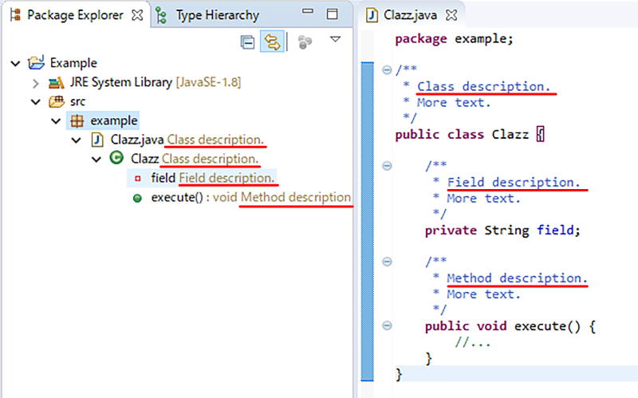

# JavadocDecorator

This plugin is very simple. Decorate Java elements with Javadoc
headings or method return values.  
Just installing it will help you get a quick overview of the
class library.

すごくシンプルなEclipseプラグインです。パッケージエクスプローラ等に表示されるJavaの要素に
Javadocの見出し部分または戻り値の説明を表示します。  
インストールするだけで、クラスライブラリの概要を素早く理解する助けになります。

## Installation / インストール方法
- Drag and drop the button below onto the Eclipse workbench.

  下のボタンをEclipseのワークベンチにドラッグ&ドロップしてください。

  

- Choose Install New Software... in Help menu and enter the following URL.

  [ヘルプ]メニューの[新規ソフトウェアのインストール...]を選択し、次のURLを入力します。

  <https://imkrmgn.github.io/JavadocDecorator>

